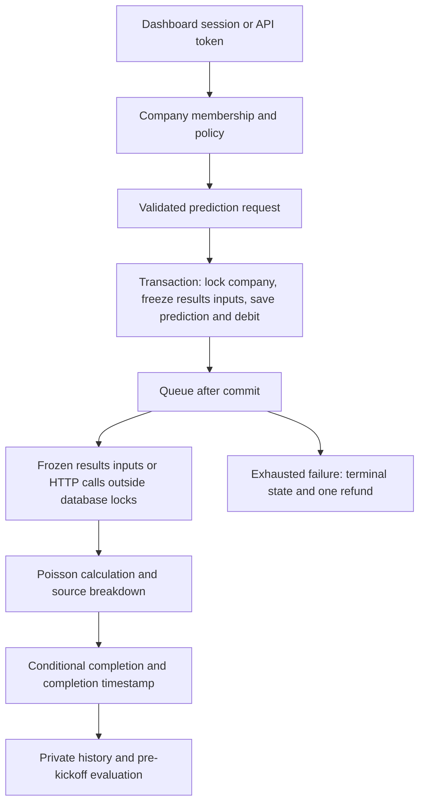

# Bolum — Football intelligence

Bolum combines a Laravel 13 API with a responsive dashboard for fixtures, company-owned predictions, provider comparisons, and outcome tracking. Browser sessions use secure cookies; API clients can use Sanctum bearer tokens.

## Start locally

Requires **PHP 8.4+**, Composer, and PDO SQLite. The dashboard is served directly by Laravel, so **no frontend build is needed to run it**.

From the project directory, these commands work in Bash and Windows PowerShell:

```text
composer setup
php artisan serve
```

Setup installs the locked dependencies, creates `.env` and the SQLite file if missing, generates a key only when absent, and migrates/seeds without resetting existing data. It is intended for local use. For Windows/Herd, select PHP 8.4+ for this project and confirm that terminal `php -v` uses that version.

For manual steps, MySQL configuration and migration troubleshooting, see [Installation guide](docs/INSTALLATION.md). MySQL should use **8.0/8.4, InnoDB and pages of at least 16 KB**; new tables explicitly use DYNAMIC row format. The default SQLite setup avoids MySQL server-configuration differences.

Open **http://127.0.0.1:8000**. In another terminal:

```bash
php artisan queue:work --tries=3 --timeout=60
```

For an existing installation, keep your `.env` and application key, run `php artisan migrate`, and restart queue workers after updating code.

| Local account | Password | Access |
| --- | --- | --- |
| `admin@bolum.test` | `password123` | Catalog administrator and Bolum Demo owner |
| `member@bolum.test` | `password123` | Bolum Demo member |

You can also register through the dashboard. Registration creates a company and grants 10 demo credits. Sample accounts are only seeded in local/testing environments.

To prepare fresh upcoming sample fixtures:

```bash
php artisan demo:refresh
```

This command preserves prediction history, recorded results, and existing credit balances. It reuses unused sample fixtures where possible and creates replacements when an old fixture already has history. It is blocked outside local/testing environments.

## In the dashboard

The dashboard opens in a charcoal dark theme with teal accents and an expandable sidebar. The sidebar starts expanded; its toggle remembers your preference. The header's theme switch saves your light/dark preference locally. Match shortcuts select upcoming, live, or finished fixtures; Reset restores the default upcoming view. Mobile fixtures use full-width cards, and loading/error states, dialogs, and charts follow the selected theme.

Imported teams display their real crests on fixture cards and match details. Crests come from the football-data.org feed and load from its public image CDN, with initials as a fallback for missing or unavailable artwork. After updating, run `php artisan migrate` and `php artisan fixtures:sync` to populate existing teams' crest URLs.

- **Match center:** opens on upcoming fixtures and selects an imported league when available. Search as you type (300 ms debounce), filter season/gameweek/status, browse paginated fixtures, and inspect predictions. Select All matches to include past results. The league selector uses imported leagues when present, stays disabled while only one is available, and unlocks when another is imported. The local catalog remains available through the API and admin fixture controls. Administrators can add fixtures and record final scores after kickoff.
- **Predictions:** company-scoped history, pending/completed/failed states, credit activity, and owner-only demo top-ups.
- **Match analysis:** win/draw/loss probabilities, expected goals, the most likely score, five likely scorelines, goal-total probabilities, both-teams-to-score probability, and each provider's contribution.
- **League table:** official standings with club crests, points, goals, season and fetch time. Tables are cached for ten minutes and have loading/retry states.
- **Recent form:** up to five recorded results for each team, with venue and scores from that team’s perspective.
- **Performance:** accuracy, multiclass Brier score, log loss, and confidence calibration against recorded results. Sample, mixed, and external inputs are reported separately.
- **My profile:** open `/profile` or select your avatar to edit your display name and choose a football avatar. Email is read-only. Password changes require your current password and confirmation, revoke API tokens, clear database sessions, and ask you to sign in again.
- **Operations (admin only):** a navy-and-amber control room, separate from the teal football workspace, with active-provider counts, pending/stale requests, recent failures, imported-fixture totals, provider configuration, telemetry and sync controls. Counts describe stored work; they do not claim a worker is online. Its Gameweek track record compares saved pre-kickoff forecasts with final scores, shows correct/evaluated counts and outcome accuracy, and marks missing forecasts explicitly.

Forms provide inline field errors, password-confirmation checks and submit loading states. The server remains authoritative for validation and permissions. Prediction requests show progress and recoverable errors inside match details; pending results show a queue state and automatic refresh status.

The browser does not store bearer tokens in local storage. Session routes use Laravel's request-forgery protection; the client also sends its CSRF token. Company membership and action policies apply to both browser and token clients.

Fresh installations start with deterministic **synthetic inputs**. Enable the match-results provider after importing sufficient real results using the command below. Credits are free demo units with no monetary value. Imported real fixtures do not automatically turn synthetic predictions into real-data forecasts.

## Real fixture synchronization

The importer integrates with the [football-data.org competition matches endpoint](https://docs.football-data.org/general/v4/competition.html). Set these values in `.env`:

```dotenv
FOOTBALL_DATA_TOKEN=your-token
FOOTBALL_COMPETITION=PL
# Optional starting year; leave blank for the provider's current season.
FOOTBALL_SEASON=
FOOTBALL_SYNC_ENABLED=false
```

Then run:

```bash
php artisan config:clear
php artisan fixtures:sync
```

Reload the dashboard after the first import. It will select the imported league and show its next scheduled matches in kickoff order. Real team names and dates come from the feed; `demo:refresh` only prepares local sample fixtures. Keep the scheduler running for hourly updates when synchronization is enabled. After changing provider configuration in `.env`, restart existing queue workers so queued imports use the new settings.

Alternatively, an administrator can select **Sync fixtures** in Operations; that action queues a job. Imports use upstream IDs, validate the entire payload before domain writes, and update records idempotently. League/competition context is included in team mappings so a team imported for another competition does not change earlier fixture relationships. The importer stores season, matchday, kickoff, status, and final scores.

Live provider access depends on your token and competition permissions. Tests use fake HTTP responses; no live credentials are required for local development. Synchronization does not import historical model inputs or replay past predictions.

For hourly synchronization, set `FOOTBALL_SYNC_ENABLED=true`, then run the scheduler:

```bash
php artisan schedule:work
```

## Predictions from real match results

After importing fixtures and final scores, run:

```bash
php artisan predictions:use-results
```

This checks the earliest upcoming imported fixture, enables the `results` provider, and pauses synthetic providers. Existing HTTP providers keep their settings. The command is repeatable. Each prediction also checks its own teams: it needs at least **20 completed league matches and 3 matches per team** recorded within the last year. Insufficient history returns a clear conflict before charging a credit; no synthetic fallback is used.

The model estimates scoring rates from imported final scores using home/away attack and defence, a 90-day recency half-life, and five equivalent league-average matches to stabilize small venue samples. It then feeds Bolum's independent Poisson calculator. These are score-based expected goals, **not shot-based xG**. Estimates, counts, source fixture IDs, cutoff time, parameters and model version are frozen when the request is accepted. Workers use that snapshot even if results are corrected later.

Open a match to see recent form and generate a new forecast. Existing synthetic forecasts stay labeled sample; enabling a new provider does not rewrite history. The dashboard shows the match counts and a limited-history message when either venue sample has fewer than five matches. The API categorizes a results-only prediction as `external` (shown as Real data in the dashboard). This describes the input source, not demonstrated accuracy.

Standings and form reuse the existing connection. League tables come from the [competition standings endpoint](https://docs.football-data.org/general/v4/competition.html), default to the current season, and honor `FOOTBALL_SEASON` when configured. Form uses results already imported locally; it does not spend an API request per match detail. Keep `fixtures:sync` scheduled to collect new results. Historical fixtures imported today do not recreate data known before past kickoffs.

For the calculation, constraints and an example, see [Prediction model](docs/PREDICTIONS.md).

## Optional expected-goals gateway

The `http` prediction driver consumes a server-configured gateway. Set `FOOTBALL_GATEWAY_URL` and `FOOTBALL_GATEWAY_TOKEN`, then activate an HTTP provider in Operations. The gateway receives `GET ?fixture_id=<Bolum ID>` and must return `{"home":1.6,"away":1.1}`. It is responsible for mapping Bolum IDs and estimating expected goals from its data. This adapter is separate from the football-data.org fixture importer.

The adapter validates positive finite goals up to 10, caches successful responses for five minutes, uses bounded timeouts/retries, and records sanitized telemetry. Active providers' expected goals are combined using their configured weights. Each source's actual contribution is saved in the prediction result. If an active provider fails, the job retries; the application does not silently substitute sample data or omit the failed source.

## How the workflow stays consistent



A company-scoped idempotency key prevents repeated requests from creating another prediction or debit. Database constraints back up application checks. Jobs carry company and prediction IDs, and only pending records can transition to completed/failed. Provider and fixture snapshots preserve what was used for each prediction.

Performance reports select the latest eligible prediction per fixture within a data category. Both its request and completion must precede the original snapshotted kickoff and current kickoff. Changed team identities are excluded. Older predictions without completion timestamps or data-category metadata are excluded rather than assigned fabricated history. Scores evaluate stored forecasts; the system does not claim that retrospective access to today's statistics recreates past knowledge.

## Verify

```bash
php artisan test
vendor/bin/pint --test
composer validate --strict
```

To run the browser suite:

```bash
npm ci
npx playwright install chromium
npm run test:browser
```

For an existing local Chrome installation, set `BOLUM_CHROME_PATH=/usr/bin/google-chrome`. Browser tests start their own server on port 8012 with a new temporary SQLite database. They never reset your application's database. `BOLUM_BROWSER_PORT` can override the port.

Tests cover token/session authentication, request-forgery protection, company isolation, validation, pagination/query counts, atomic debit rollback, duplicate requests/jobs, refunds, real worker execution, provider telemetry, idempotent imports, chronological evaluation, and desktop/mobile workflows. CI runs PHP tests with SQLite/MySQL and a separate browser job. These tests do not replace production concurrency/load testing.

## Operations

```bash
php artisan queue:failed
php artisan predictions:recover
php artisan providers:prune
php artisan queue:restart
```

The scheduler recovers pending predictions older than five minutes to cover the commit-to-enqueue crash gap. Duplicate deliveries are safe. An exhausted prediction is refunded and terminal; after fixing a provider, submit a new request with a new key. Replaying the old refunded job does not generate a free result.

Provider telemetry retains 30 days through the scheduled prune command. It stores source, operation, category, HTTP status, latency, cache-hit flag, and attempt number; never credentials, upstream bodies, or raw exception messages.

Production needs persistent storage, HTTPS, `APP_DEBUG=false`, an appropriate session domain and Sanctum stateful-domain configuration, supervised workers/scheduler, backups, monitoring, and safe migrations. Owner top-ups are demo grants, not payment processing. The independent Poisson model has not been calibrated against real outcomes.

[API guide](docs/API.md) · [Example API requests](docs/api.http) · [Architecture](docs/ARCHITECTURE.md) · [Development guide](docs/DEVELOPMENT.md) · [Data integrations](docs/INTEGRATIONS.md)


## Workspaces and individual accounts

Each user has an individual login and profile. The database's `Company` model represents a workspace whose members share prediction history and demo credits. Registration currently creates a workspace and makes the new user its owner. The dashboard calls this a workspace; existing API paths and `company_id` fields are retained for compatibility.

A solo user can use their own workspace. Shared workspaces support groups of analysts and keep their histories and credits isolated. Changing to exclusively personal predictions would require migrating record ownership and credit balances; simply removing membership checks would expose private data.

## Gameweek track record

Administrators can open Operations → Gameweek track record, choose a league, season, completed/partly completed gameweek and input category, and inspect actual scores alongside Bolum's saved forecasts for the selected workspace. Correctness compares the home/draw/away outcome, not the exact scoreline. Missing forecasts and unfinished matches are excluded from the accuracy denominator. With zero eligible forecasts, accuracy is shown as unavailable rather than zero percent.

The report reuses Performance's eligibility rules. A past game without a saved pre-kickoff forecast says so. It does not create or charge for predictions, reconstruct past knowledge from today's data, or present retrospective simulations as a historical record. Historical simulation would need a separate labeled workflow and sufficient timestamped earlier inputs. Imported results alone do not establish prior forecasts.
