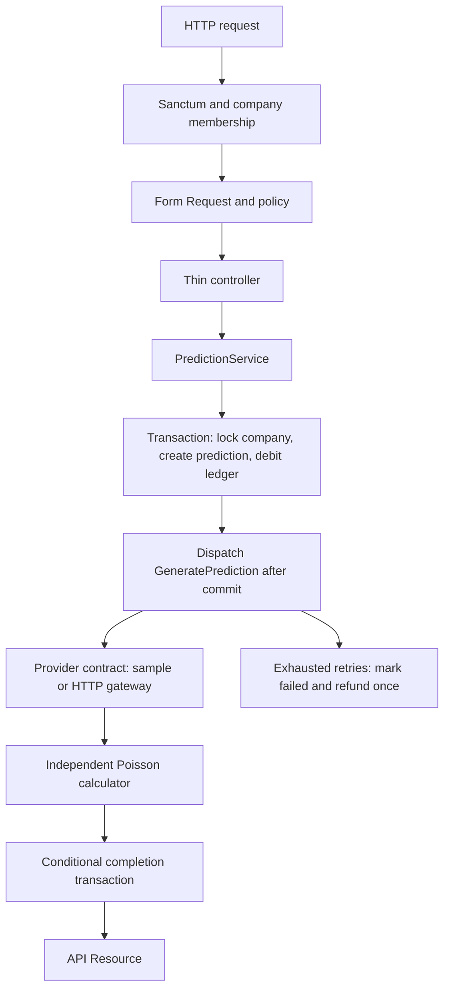

# Bolum 2.0 — Football Predictions API

A Laravel 13 API for football fixtures and company-owned predictions. Features include Sanctum authentication, Form Requests, Eloquent relationships, policies, tenant isolation, queues, caching, and transactional credit accounting.

The default provider generates deterministic **synthetic data**. Predictions demonstrate software architecture; they are not calibrated forecasts. Credits are free demo units, not money or a payment integration.

## Run locally

Requires **PHP 8.4+**, Composer, and the PDO SQLite extension. The locked dependencies require PHP 8.4 even though Laravel 13 itself supports PHP 8.3. No frontend build or API key is required.

```bash
composer install
cp .env.example .env
php artisan key:generate
php artisan migrate --seed
php artisan serve
```

In another terminal:

```bash
php artisan queue:work --tries=3 --timeout=60
```

Open `http://127.0.0.1:8000/api/v1/fixtures`. SQLite is created by Laravel when you accept the migration prompt. For noninteractive installation, create `database/database.sqlite` before migrating. The default queue and cache use database tables.

Local/testing seed credentials:

| Account | Password | Access |
| --- | --- | --- |
| `admin@bolum.test` | `password123` | Catalog administrator, Bolum Demo owner |
| `member@bolum.test` | `password123` | Bolum Demo member |

The seeder creates four upcoming fixtures, a sample provider, 10 opening credits, and a second company for isolation demonstrations. Registration also creates a company with 10 credits. Seeding is repeatable and does not replenish spent credits. Demo accounts are not seeded in production.

## API walkthrough

1. Log in and copy your company ID and token from `data.companies` and `data.token`.
2. Fetch a paginated fixture list, including league and team details.
3. Submit a fixture update with identical home and away teams to inspect the `422` validation response.
4. Request a prediction with an idempotency key; the API returns `202` and debits one credit.
5. Repeat the request with the same key to retrieve the existing prediction without another debit.
6. Run the worker and fetch the completed prediction.
7. View the company's credit ledger to inspect grants, debits, and refunds.

Copyable requests are in [docs/api.http](docs/api.http); the complete endpoint guide is in [docs/API.md](docs/API.md). See [docs/DEVELOPMENT.md](docs/DEVELOPMENT.md) for code organization and development guidance.

## Architecture



Leagues, teams, and fixtures form a **public shared catalog**. Each company has users through a membership pivot, its own predictions, a credit balance, and an append-only application ledger. Administrators manage the catalog; company owners may top up demo credits. Admin status does not bypass company membership.

Prediction detail routes use scoped bindings; lists, histories, and latest results explicitly query the selected company's relationship. Jobs carry both company and prediction IDs. Provider data is public football information, so its cache is shared and contains no company data.

## Verify

```bash
php artisan test
vendor/bin/pint --test
composer validate --strict
```

Tests cover authentication, authorization, partial-update validation, pagination, constant query counts, isolation, idempotency conflicts, rollback, real database queue processing, exhausted-job refunds, faked HTTP retries/cache, and calculation invariants. GitHub Actions runs formatting and tests with SQLite and MySQL. Local verification was performed with SQLite; MySQL CI runs after you push.

## Queue operations

```bash
php artisan queue:work --tries=3 --timeout=60
php artisan queue:failed
php artisan predictions:recover
php artisan schedule:work
```

`predictions:recover` requeues pending requests older than five minutes. This covers the small gap between committing the database transaction and dispatching its job. Schedule it with Laravel's scheduler. Duplicate deliveries are safe: the worker only transitions a pending record once, and refund keys are unique. An exhausted, refunded prediction is terminal; make a new request with a new key after fixing the provider. Replaying its old failed job does not charge or regenerate it.

Provider and fixture snapshots preserve the inputs of a requested prediction even when an administrator later changes the catalog. HTTP calls happen outside database transactions. Jobs use three attempts, backoff, a 60-second timeout, and a cache overlap lock. Restart long-running workers after deployment with `php artisan queue:restart`.

## Optional HTTP provider

The sample provider works offline. An optional `http` driver consumes your own trusted expected-goals gateway; it is **not a completed API-Football integration**. Configure `FOOTBALL_GATEWAY_URL` and `FOOTBALL_GATEWAY_TOKEN` in `.env`, then add an active provider through the admin endpoint. The gateway receives `GET ?fixture_id=<Bolum fixture ID>` and must return `{"home":1.6,"away":1.1}`. It is responsible for mapping Bolum IDs to its upstream vendor IDs.

The adapter validates positive finite expected goals up to 10, caches successful responses for five minutes, times out, retries once, and turns upstream errors into safe exceptions. Active providers are combined using weighted expected goals before calculating the distribution. If any active provider fails, the job retries; it never silently substitutes synthetic data.

## Deliberate limits and production follow-up

- This is a focused API with no frontend, real payment processing, company invitation flow, or financial ERP module.
- Integer credits illustrate accounting without floating-point money. Owner top-ups are explicitly free demo grants. A real billing system would need verified payment events, currency rules, and independent reconciliation.
- MySQL/PostgreSQL support row locking; SQLite is convenient for demos but does not prove concurrent row-lock behavior. Database uniqueness and conditional state transitions protect retries; load-test contention using your production engine before deployment.
- Prediction history belongs to companies and is private. Public prediction endpoints were intentionally excluded to preserve tenant privacy.
- No raw secrets or upstream bodies are included in provider failures. Failed jobs are operational records and should have restricted access and retention limits.
- Before deployment, configure HTTPS, `APP_DEBUG=false`, persistent database/queue storage, scheduler and worker supervision, backups, monitoring, token cleanup, and a deployment migration strategy. For a first-party SPA, use Sanctum's cookie flow rather than persisting bearer tokens in browser storage.

See [docs/ARCHITECTURE.md](docs/ARCHITECTURE.md) for transaction and isolation decisions.
