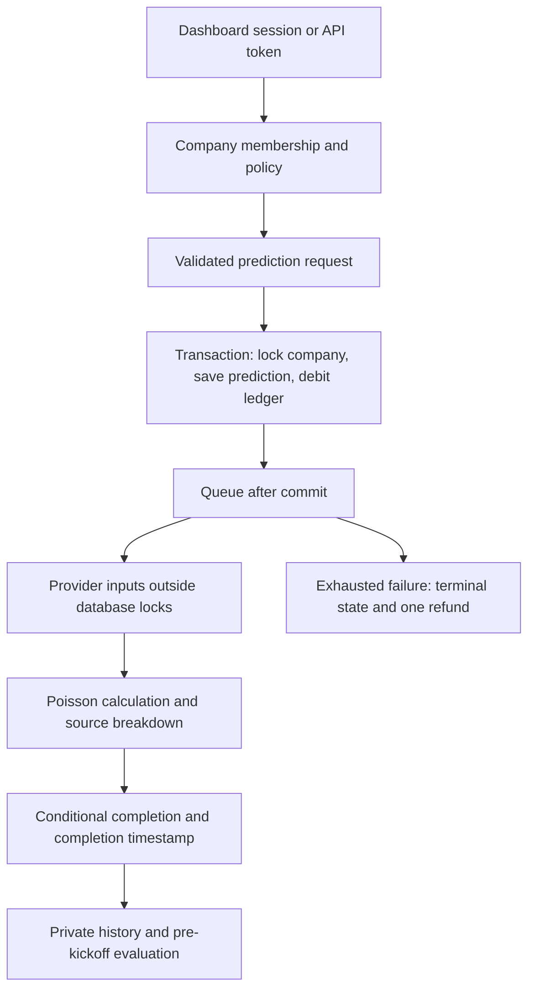

# Bolum — Football intelligence

Bolum combines a Laravel 13 API with a responsive dashboard for fixtures, company-owned predictions, provider comparisons, and outcome tracking. Browser sessions use secure cookies; API clients can use Sanctum bearer tokens.

## Start locally

Requires **PHP 8.4+**, Composer, and PDO SQLite. The dashboard is served directly by Laravel, so **no frontend build is needed to run it**.

```bash
composer install
# On first installation only:
cp .env.example .env
php artisan key:generate
touch database/database.sqlite
php artisan migrate --seed
php artisan serve
```

Open **http://127.0.0.1:8000**. In another terminal:

```bash
php artisan queue:work --tries=3 --timeout=60
```

For an existing installation, keep your `.env` and application key, run `php artisan migrate`, and restart queue workers after updating code.

| Local account | Password | Access |
| --- | --- | --- |
| `admin@bolum.test` | `password123` | Catalog administrator and Bolum Demo owner |
| `member@bolum.test` | `password123` | Bolum Demo member |

You can also register through the dashboard. Registration creates a company and grants 10 demo credits. Sample accounts are only seeded in local/testing environments.

To prepare fresh upcoming sample fixtures:

```bash
php artisan demo:refresh
```

This command preserves prediction history, recorded results, and existing credit balances. It reuses unused sample fixtures where possible and creates replacements when an old fixture already has history. It is blocked outside local/testing environments.

## In the dashboard

The dashboard opens in dark mode. The header's theme switch saves your light/dark preference locally. Match shortcuts select upcoming, live, or finished fixtures; Reset restores the default upcoming view. Mobile fixtures use full-width cards, and loading/error states, dialogs, and charts follow the selected theme.

- **Match center:** opens on upcoming fixtures and selects an imported league when available. Search teams, filter leagues/status, browse paginated fixtures, and inspect predictions. Select All matches to include past results, or All leagues to include the local catalog. Administrators can add fixtures and record final scores after kickoff.
- **Predictions:** company-scoped history, pending/completed/failed states, credit activity, and owner-only demo top-ups.
- **Match analysis:** win/draw/loss probabilities, expected goals, the most likely score, five likely scorelines, goal-total probabilities, both-teams-to-score probability, and each provider's contribution.
- **Performance:** accuracy, multiclass Brier score, log loss, and confidence calibration against recorded results. Sample, mixed, and external inputs are reported separately.
- **Data sources:** admin provider configuration, cache activity, latency, safe failure categories, and fixture synchronization status.

The browser does not store bearer tokens in local storage. Session routes use Laravel's request-forgery protection; the client also sends its CSRF token. Company membership and action policies apply to both browser and token clients.

The default prediction provider uses deterministic **synthetic inputs**. Credits are free demo units with no monetary value. Imported real fixtures do not automatically turn synthetic predictions into real-data forecasts.

## Real fixture synchronization

The importer integrates with the [football-data.org competition matches endpoint](https://docs.football-data.org/general/v4/competition.html). Set these values in `.env`:

```dotenv
FOOTBALL_DATA_TOKEN=your-token
FOOTBALL_COMPETITION=PL
# Optional starting year; leave blank for the provider's current season.
FOOTBALL_SEASON=
FOOTBALL_SYNC_ENABLED=false
```

Then run:

```bash
php artisan config:clear
php artisan fixtures:sync
```

Reload the dashboard after the first import. It will select the imported league and show its next scheduled matches in kickoff order. Real team names and dates come from the feed; `demo:refresh` only prepares local sample fixtures. Keep the scheduler running for hourly updates when synchronization is enabled. After changing provider configuration in `.env`, restart existing queue workers so queued imports use the new settings.

Alternatively, an administrator can select **Sync fixtures** in Data sources; that action queues a job. Imports use upstream IDs, validate the entire payload before domain writes, and update records idempotently. League/competition context is included in team mappings so a team imported for another competition does not change earlier fixture relationships. The importer stores season, matchday, kickoff, status, and final scores.

Live provider access depends on your token and competition permissions. Tests use fake HTTP responses; no live credentials are required for local development. Synchronization does not import historical model inputs or replay past predictions.

For hourly synchronization, set `FOOTBALL_SYNC_ENABLED=true`, then run the scheduler:

```bash
php artisan schedule:work
```

## Optional expected-goals gateway

The `http` prediction driver consumes a server-configured gateway. Set `FOOTBALL_GATEWAY_URL` and `FOOTBALL_GATEWAY_TOKEN`, then activate an HTTP provider in Data sources. The gateway receives `GET ?fixture_id=<Bolum ID>` and must return `{"home":1.6,"away":1.1}`. It is responsible for mapping Bolum IDs and estimating expected goals from its data. This adapter is separate from the football-data.org fixture importer.

The adapter validates positive finite goals up to 10, caches successful responses for five minutes, uses bounded timeouts/retries, and records sanitized telemetry. Active providers' expected goals are combined using their configured weights. Each source's actual contribution is saved in the prediction result. If an active provider fails, the job retries; the application does not silently substitute sample data or omit the failed source.

## How the workflow stays consistent



A company-scoped idempotency key prevents repeated requests from creating another prediction or debit. Database constraints back up application checks. Jobs carry company and prediction IDs, and only pending records can transition to completed/failed. Provider and fixture snapshots preserve what was used for each prediction.

Performance reports select the latest eligible prediction per fixture within a data category. Both its request and completion must precede the original snapshotted kickoff and current kickoff. Changed team identities are excluded. Older predictions without completion timestamps or data-category metadata are excluded rather than assigned fabricated history. Scores evaluate stored forecasts; the system does not claim that retrospective access to today's statistics recreates past knowledge.

## Verify

```bash
php artisan test
vendor/bin/pint --test
composer validate --strict
```

To run the browser suite:

```bash
npm ci
npx playwright install chromium
npm run test:browser
```

For an existing local Chrome installation, set `BOLUM_CHROME_PATH=/usr/bin/google-chrome`. Browser tests start their own server on port 8012 with a new temporary SQLite database. They never reset your application's database. `BOLUM_BROWSER_PORT` can override the port.

Tests cover token/session authentication, request-forgery protection, company isolation, validation, pagination/query counts, atomic debit rollback, duplicate requests/jobs, refunds, real worker execution, provider telemetry, idempotent imports, chronological evaluation, and desktop/mobile workflows. CI runs PHP tests with SQLite/MySQL and a separate browser job. These tests do not replace production concurrency/load testing.

## Operations

```bash
php artisan queue:failed
php artisan predictions:recover
php artisan providers:prune
php artisan queue:restart
```

The scheduler recovers pending predictions older than five minutes to cover the commit-to-enqueue crash gap. Duplicate deliveries are safe. An exhausted prediction is refunded and terminal; after fixing a provider, submit a new request with a new key. Replaying the old refunded job does not generate a free result.

Provider telemetry retains 30 days through the scheduled prune command. It stores source, operation, category, HTTP status, latency, cache-hit flag, and attempt number; never credentials, upstream bodies, or raw exception messages.

Production needs persistent storage, HTTPS, `APP_DEBUG=false`, an appropriate session domain and Sanctum stateful-domain configuration, supervised workers/scheduler, backups, monitoring, and safe migrations. Owner top-ups are demo grants, not payment processing. The independent Poisson model has not been calibrated against real outcomes.

[API guide](docs/API.md) · [Example API requests](docs/api.http) · [Architecture](docs/ARCHITECTURE.md) · [Development guide](docs/DEVELOPMENT.md)
